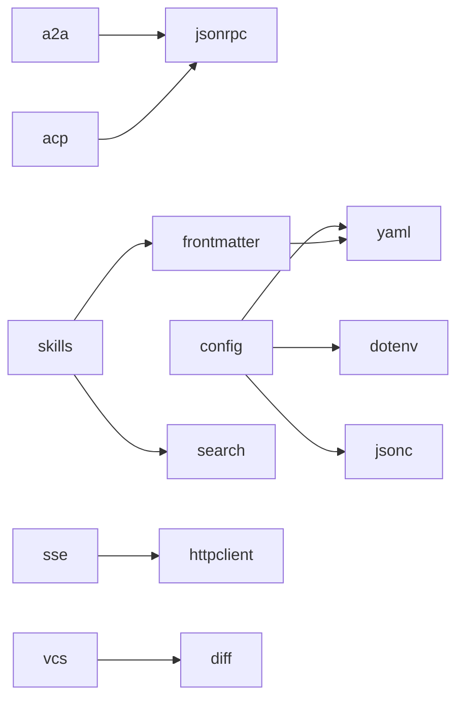

# Manifest 清单

`manifest.json` 是模块索引文件，CLI 工具通过它发现可用模块、获取元数据和解析依赖关系。

## 概览

- **位置**：仓库根目录的 `manifest.json`
- **生成方式**：`zerodep manifest`（或 `make manifest`）
- **数据来源**：模块源文件（`# /// zerodep` frontmatter + docstring）
- **使用者**：`zerodep` CLI 工具（list、info、add 命令）

## 格式

```json
{
  "version": "1",
  "generated": "2026-03-28T05:27:00+00:00",
  "modules": {
    "scheduler": {
      "description": "Zero-dependency in-process task scheduler with cron support",
      "files": ["scheduler/scheduler.py"],
      "version": "0.4.0",
      "deps": [],
      "tier": "subsystem",
      "category": "util",
      "last_updated": "2026-04-09T22:14:17+08:00",
      "content_hash": "a1b2c3..."
    },
    "sse": {
      "description": "Zero-dependency SSE (Server-Sent Events) client",
      "files": ["sse/sse.py"],
      "version": "0.4.0",
      "deps": ["httpclient"],
      "tier": "subsystem",
      "category": "network",
      "last_updated": "2026-04-09T22:14:17+08:00",
      "content_hash": "d4e5f6..."
    }
  }
}
```

### 顶层字段

| 字段 | 类型 | 说明 |
|------|------|------|
| `version` | `string` | 清单格式版本号（当前为 `"1"`） |
| `generated` | `string` | ISO 8601 格式的生成时间戳 |
| `modules` | `object` | 模块名到模块元数据的映射 |

### 模块字段

| 字段 | 类型 | 说明 |
|------|------|------|
| `description` | `string` | 模块 docstring 的第一行 |
| `files` | `list[string]` | 模块 `.py` 文件的相对路径列表 |
| `version` | `string` | frontmatter 注释块中的版本号 |
| `deps` | `list[string]` | 兄弟模块依赖 |
| `tier` | `string` | 复杂度层级（`simple`、`moderate`、`subsystem`） |
| `category` | `string` | 功能分类（`data`、`network`、`util` 等） |
| `last_updated` | `string\|null` | 主文件最后一次 git 提交的 ISO 8601 时间戳 |
| `content_hash` | `string` | 去除 frontmatter 后主文件内容的 SHA-256 哈希值 |

!!! tip
    `content_hash` 排除了 `# /// zerodep` frontmatter 注释块，因此仅元数据变更（版本号更新、tier 调整）不会改变哈希值。使用 `zerodep outdated` 可将本地文件与这些哈希值进行对比。

## 生成原理

`zerodep manifest` 命令递归扫描仓库中的模块目录：

1. **发现目录** — 递归遍历所有目录，在任意层级跳过已知的非模块目录（`.git`、`docs_en`、`plans` 等）
2. **查找 Python 文件** — 收集每个目录中非测试的 `.py` 文件
3. **识别主文件** — 优先选择 `<目录名>.py`，否则使用第一个文件
4. **注册模块** — 模块名取叶子目录名（例如 `network/httpclient/` 注册为 `httpclient`）。不含 `.py` 文件的中间分组目录仅被穿透而不注册。重名模块会触发警告，保留先发现的
5. **提取元数据**：
    - `version` 和 `deps` — 从 `# /// zerodep` frontmatter 注释块中提取，通过 `ast.literal_eval` 解析
    - 模块 docstring 首行 — 通过 `ast.parse`
6. **写入** `manifest.json`

### 跳过的目录

以下目录不会被扫描：

```
build, dist, docs_en, docs_zh, plans, .git, .github,
__pycache__, .pytest_cache, .ruff_cache, site
```

## 模块元数据规范

每个模块的主 `.py` 文件应在文件最顶部、模块 docstring 之前声明一个 PEP 723 风格的 frontmatter 注释块：

```python
# /// zerodep
# version = "0.1.0"
# deps = ["httpclient"]
# ///
"""首行将成为 manifest.json 中的描述。"""
```

| 字段 | 必需 | 说明 |
|------|------|------|
| `version` | 是 | 语义化版本字符串 |
| `deps` | 是 | 本模块导入的兄弟 zerodep 模块名列表 |
| 模块 docstring | 推荐 | 首行用作描述 |

!!! note
    此格式受 [PEP 723](https://peps.python.org/pep-0723/) 内联脚本元数据启发。元数据完全存在于注释中，对运行时零影响——不会污染命名空间，不存在 Python 保留变量名冲突的风险。

### 当前依赖关系图



其他所有模块的 `deps = []`（无兄弟依赖）。

## 重新生成

### 通过 CLI

```bash
python zerodep.py manifest
```

### 通过 Make

```bash
make manifest
```

### 何时需要重新生成

在以下情况后需要重新生成 `manifest.json`：

- 添加了新模块
- 修改了模块 frontmatter 中的 `version`
- 添加或移除了 `deps` 条目
- 修改了模块 docstring 的首行

!!! tip
    manifest 应提交到仓库，这样远程用户无需克隆完整仓库即可获取索引。建议在 CI 流程中加入 `make manifest` 以保持同步。
