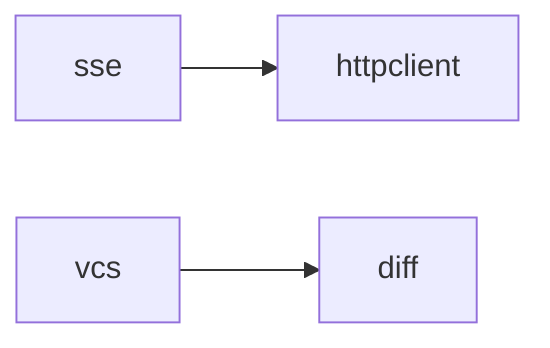

# Manifest

The `manifest.json` file is the module index that the CLI uses to discover available modules, their metadata, and dependency relationships.

## Overview

- **Location**: `manifest.json` in the repository root
- **Generated by**: `zerodep manifest` (or `make manifest`)
- **Source of truth**: module source files (`# /// zerodep` frontmatter + docstrings)
- **Consumers**: the `zerodep` CLI tool (list, info, add commands)

## Format

```json
{
  "version": "1",
  "generated": "2026-03-28T05:27:00+00:00",
  "modules": {
    "scheduler": {
      "description": "Zero-dependency in-process task scheduler with cron support",
      "files": ["scheduler/scheduler.py"],
      "version": "0.1.0",
      "deps": []
    },
    "sse": {
      "description": "Zero-dependency SSE (Server-Sent Events) client",
      "files": ["sse/sse.py"],
      "version": "0.1.0",
      "deps": ["httpclient"]
    }
  }
}
```

### Top-Level Fields

| Field | Type | Description |
|-------|------|-------------|
| `version` | `string` | Manifest schema version (currently `"1"`) |
| `generated` | `string` | ISO 8601 timestamp of generation |
| `modules` | `object` | Map of module name to module metadata |

### Module Fields

| Field | Type | Description |
|-------|------|-------------|
| `description` | `string` | First line of the module docstring |
| `files` | `list[string]` | Relative paths to the module's `.py` files |
| `version` | `string` | Value of `__version__` in the primary file |
| `deps` | `list[string]` | Sibling module dependencies (from `__deps__`) |

## How It's Generated

The `zerodep manifest` command recursively scans the repository for module directories:

1. **Discover directories** — recursively walk all directories, skip known non-module dirs (`.git`, `docs_en`, `plans`, etc.) at any depth
2. **Find Python files** — collect non-test `.py` files in each directory
3. **Identify primary file** — prefer `<dirname>.py`, fall back to the first file
4. **Register module** — the module name is the leaf directory name (e.g. `network/httpclient/` registers as `httpclient`). Intermediate grouping directories that contain no `.py` files are traversed but not registered. Duplicate module names trigger a warning, keeping the first one found
5. **Extract metadata** from the primary file:
    - `version` and `deps` — from `# /// zerodep` frontmatter block via `ast.literal_eval`
    - Module docstring first line — via `ast.parse`
6. **Write** `manifest.json` with all discovered modules

### Skipped Directories

The following directories are not scanned for modules:

```
docs_en, docs_zh, plans, .git, .github,
__pycache__, .pytest_cache, .ruff_cache, site
```

## Module Metadata Convention

Each module's primary `.py` file should declare a PEP 723-style frontmatter block at the very top, before the module docstring:

```python
# /// zerodep
# version = "0.1.0"
# deps = ["httpclient"]
# ///
"""First line becomes the description in manifest.json."""
```

| Field | Required | Description |
|-------|----------|-------------|
| `version` | Yes | Semantic version string |
| `deps` | Yes | List of sibling zerodep module names this module imports |
| Module docstring | Recommended | First line used as description |

!!! note
    This format is inspired by [PEP 723](https://peps.python.org/pep-0723/) inline script metadata. It lives entirely in comments, so it has zero runtime impact — no namespace pollution, no risk of Python reserving the variable name.

### Current Dependency Graph



All other modules have `__deps__: list[str] = []` (no sibling dependencies).

## Regenerating

### Via CLI

```bash
python zerodep.py manifest
```

### Via Make

```bash
make manifest
```

### When to Regenerate

Regenerate `manifest.json` whenever you:

- Add a new module
- Change a module's `version` in the frontmatter
- Add or remove a `deps` entry
- Change a module's docstring first line

!!! tip
    The manifest should be committed to the repository so that remote users can fetch it without cloning the full repo. Consider adding `make manifest` to your CI pipeline to keep it in sync.
