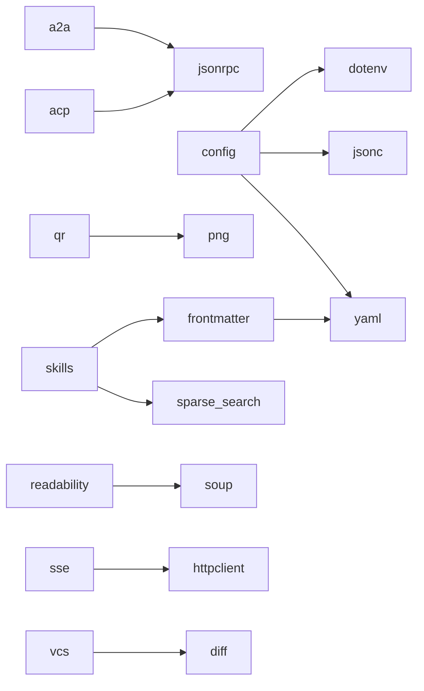

<!-- AUTO-GENERATED by scripts/generate_module_index.py — DO NOT EDIT -->

---
title: Module Overview
---

# Module Overview

Each zerodep module is a **self-contained single `.py` file** that you can copy directly into your project. No `pip install` required at runtime.

## Module Status

| Module | Version | Last Updated |
|--------|---------|--------------|
| [a2a](a2a.md) | 0.3.1 | 2026-04-20 |
| [acp](acp.md) | 0.3.1 | 2026-04-15 |
| [aes](aes.md) | 0.5.0 | 2026-04-20 |
| [ansi](ansi.md) | 0.3.0 | 2026-04-11 |
| [cache](cache.md) | 0.2.4 | 2026-04-20 |
| [config](config.md) | 0.3.0 | 2026-04-11 |
| [depdetect](depdetect.md) | 0.4.3 | 2026-04-15 |
| [diff](diff.md) | 0.3.1 | 2026-04-15 |
| [dotenv](dotenv.md) | 0.3.1 | 2026-04-15 |
| [filelock](filelock.md) | 0.3.0 | 2026-04-11 |
| [frontmatter](frontmatter.md) | 0.3.0 | 2026-04-11 |
| [httpclient](http.md) | 0.3.1 | 2026-04-15 |
| [jsonc](jsonc.md) | 0.3.0 | 2026-04-11 |
| [jsonrpc](jsonrpc.md) | 0.3.0 | 2026-04-11 |
| [jsonschema](jsonschema.md) | 0.1.0 | 2026-04-25 |
| [llmstxt](llmstxt.md) | 0.1.0 | 2026-04-27 |
| [markdown](markdown.md) | 0.4.0 | 2026-04-26 |
| [persistdict](persistdict.md) | 0.4.1 | 2026-04-20 |
| [png](png.md) | 0.1.0 | 2026-04-27 |
| [prompt](prompt.md) | 0.2.0 | 2026-04-11 |
| [protobuf](protobuf.md) | 0.4.3 | 2026-04-25 |
| [qr](qr.md) | 0.3.2 | 2026-04-27 |
| [readability](readability.md) | 0.1.0 | 2026-04-20 |
| [retry](retry.md) | 0.3.0 | 2026-04-11 |
| [runner](runner.md) | 0.3.1 | 2026-04-15 |
| [scheduler](scheduler.md) | 0.3.1 | 2026-04-15 |
| [semver](semver.md) | 0.4.1 | 2026-04-20 |
| [skills](skills.md) | 0.4.2 | 2026-04-20 |
| [soup](soup.md) | 0.6.0 | 2026-04-26 |
| [sparse_search](sparse_search.md) | 0.4.0 | 2026-04-27 |
| [sse](sse.md) | 0.3.1 | 2026-04-15 |
| [structlog](structlog.md) | 0.3.0 | 2026-04-11 |
| [tabulate](tabulate.md) | 0.1.1 | 2026-04-15 |
| [toon](toon.md) | 0.3.3 | 2026-04-15 |
| [validate](validate.md) | 0.4.2 | 2026-04-27 |
| [vcs](vcs.md) | 0.3.0 | 2026-04-11 |
| [xml](xml.md) | 0.3.1 | 2026-04-15 |
| [yaml](yaml.md) | 0.3.1 | 2026-04-15 |

## All Modules

### Web & Networking

| Module | Description | Benchmark Against |
|--------|-------------|-------------------|
| [httpclient](http.md) | Sync + async REST client with connection pooling, proxy, and auth | `httpx` |
| [sse](sse.md) | Server-Sent Events client with auto-reconnect | `httpx-sse` |

### Agent Protocols

| Module | Description | Benchmark Against |
|--------|-------------|-------------------|
| [jsonrpc](jsonrpc.md) | JSON-RPC 2.0 protocol: data types, dispatcher, async transport | `jsonrpcserver` |
| [a2a](a2a.md) | Google A2A protocol: JSON-RPC 2.0, SSE streaming, task management | `a2a-python` |
| [acp](acp.md) | Anthropic ACP protocol: JSON-RPC 2.0 over stdio, async client/agent | `acp-python` |
| [skills](skills.md) | Agent Skills runtime: parse, discover, manage, select skills | -- |

### Image

| Module | Description | Benchmark Against |
|--------|-------------|-------------------|
| [png](png.md) | PNG/BMP image codec with matrix compression API | `Pillow` |

### Data Formats

| Module | Description | Benchmark Against |
|--------|-------------|-------------------|
| [xml](xml.md) | XML ↔ dict converter with fault-tolerant parsing and LLM tag extraction | `xmltodict` |
| [yaml](yaml.md) | YAML parser and serializer (common subset) | `PyYAML` |
| [jsonc](jsonc.md) | JSONC parser (JSON with comments and trailing commas) | `commentjson` |
| [toon](toon.md) | TOON (Token-Oriented Object Notation) encoder/decoder | `toon_format` |
| [frontmatter](frontmatter.md) | Frontmatter parser and serializer (YAML/TOML/JSON) | `python-frontmatter` |
| [protobuf](protobuf.md) | Proto3 encoder/decoder using Python dataclass schemas | `protobuf` |
| [llmstxt](llmstxt.md) | llms.txt parser and markdown URL candidate finder | -- |

### Data Validation

| Module | Description | Benchmark Against |
|--------|-------------|-------------------|
| [validate](validate.md) | Runtime TypedDict/dataclass validator with JSON Schema generation | `pydantic` |
| [jsonschema](jsonschema.md) | JSON Schema flattening & sanitization (`$ref`, `allOf`, `anyOf`) | `allof-merge` |
| [semver](semver.md) | PEP 440 version parser and comparator | `packaging` |

### Text & Markup

| Module | Description | Benchmark Against |
|--------|-------------|-------------------|
| [markdown](markdown.md) | Markdown to HTML renderer (CommonMark subset + GFM tables) | `mistune` |
| [soup](soup.md) | HTML parser with BeautifulSoup-like API (find, select, CSS selectors) | `beautifulsoup4` |
| [readability](readability.md) | Article content extractor ported from Mozilla Readability.js | `readability-lxml` |
| [diff](diff.md) | Unified diff parser, patch apply/reverse, three-way merge | `unidiff` |

### Search & Retrieval

| Module | Description | Benchmark Against |
|--------|-------------|-------------------|
| [sparse_search](sparse_search.md) | BM25/BM25+/BM25L/BM25F + TF-IDF full-text search with Bayesian calibration, RRF fusion, MMR diversity | `rank-bm25` |

### Configuration

| Module | Description | Benchmark Against |
|--------|-------------|-------------------|
| [dotenv](dotenv.md) | .env file parser (load_dotenv, dotenv_values) | `python-dotenv` |
| [config](config.md) | Unified config loader (env vars, .env, JSON/YAML/TOML/INI) | `python-decouple` |

### CLI & Terminal

| Module | Description | Benchmark Against |
|--------|-------------|-------------------|
| [ansi](ansi.md) | ANSI terminal styling: colors, attributes, detection, strip/visible_len | -- |
| [tabulate](tabulate.md) | Table formatting with multiple output styles | `tabulate` |
| [prompt](prompt.md) | Interactive CLI prompts (confirm, select, text) | `questionary` |

### Security

| Module | Description | Benchmark Against |
|--------|-------------|-------------------|
| [aes](aes.md) | AES encryption: ECB, CBC, CTR, GCM modes (pure Python + OpenSSL via ctypes) | `pycryptodome` |

### Infrastructure & Tools

| Module | Description | Benchmark Against |
|--------|-------------|-------------------|
| [cache](cache.md) | In-memory cache with TTL, LRU/LFU eviction, and async support | `cachetools` |
| [retry](retry.md) | Decorator-based retry with configurable backoff strategies | `tenacity` |
| [scheduler](scheduler.md) | In-process task scheduler with cron, interval, one-shot triggers | `APScheduler` |
| [structlog](structlog.md) | Structured logging with pretty console output | `structlog` |
| [vcs](vcs.md) | Git/Hg/Jujutsu CLI wrapper (diff, status, log, blame) | -- |
| [runner](runner.md) | Structured subprocess execution with timeout escalation | -- |
| [filelock](filelock.md) | Cross-platform advisory file lock (fcntl/msvcrt) | -- |
| [persistdict](persistdict.md) | Persistent dict with pluggable backends (JSON, SQLite) | -- |
| [qr](qr.md) | QR Code generation with terminal rendering | `qrcode` |
| [depdetect](depdetect.md) | Dependency detection and verification | -- |

## Inter-Module Dependencies

Most zerodep modules are fully standalone. The following modules depend on other zerodep modules:

When using the [CLI tool](../guide/cli.md), dependencies are resolved automatically. For manual installation, ensure all required modules are present.
