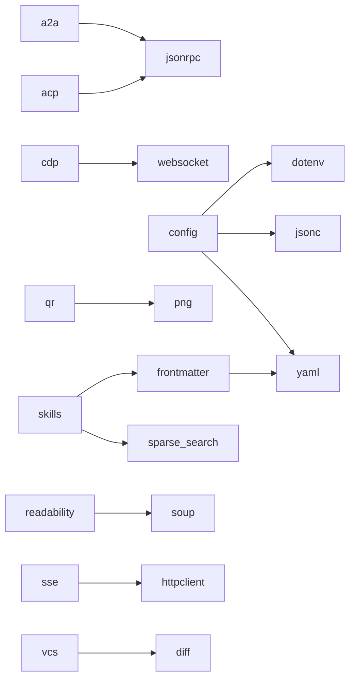

<!-- AUTO-GENERATED by _scripts/generate_module_index.py — DO NOT EDIT -->

---
title: 模块概览
---

# 模块概览

每个 zerodep 模块都是一个**独立的单 `.py` 文件**，可以直接复制到你的项目中使用，运行时无需 `pip install`。

## 模块状态

| 模块 | 版本 | 最后更新 |
|--------|---------|--------------|
| [a2a](a2a.md) | 0.3.1 | 2026-04-27 |
| [acp](acp.md) | 0.3.1 | 2026-04-27 |
| [aes](aes.md) | 0.5.0 | 2026-04-20 |
| [ansi](ansi.md) | 0.3.0 | 2026-04-11 |
| [cache](cache.md) | 0.2.4 | 2026-04-27 |
| [cdp](cdp.md) | 0.1.0 | 2026-05-02 |
| [config](config.md) | 0.3.0 | 2026-04-27 |
| [depdetect](depdetect.md) | 0.4.3 | 2026-04-15 |
| [diff](diff.md) | 0.3.1 | 2026-04-15 |
| [dotenv](dotenv.md) | 0.3.1 | 2026-04-27 |
| [filelock](filelock.md) | 0.3.0 | 2026-04-27 |
| [frontmatter](frontmatter.md) | 0.3.0 | 2026-04-27 |
| [httpclient](httpclient.md) | 0.4.0 | 2026-05-05 |
| [httpserver](httpserver.md) | 0.1.0 | 2026-05-02 |
| [jsonc](jsonc.md) | 0.3.0 | 2026-04-27 |
| [jsonrpc](jsonrpc.md) | 0.3.0 | 2026-04-27 |
| [jsonschema](jsonschema.md) | 0.1.0 | 2026-04-27 |
| [llmstxt](llmstxt.md) | 0.1.1 | 2026-04-27 |
| [markdown](markdown.md) | 0.4.1 | 2026-04-27 |
| [persistdict](persistdict.md) | 0.4.1 | 2026-04-27 |
| [png](png.md) | 0.1.1 | 2026-04-27 |
| [prompt](prompt.md) | 0.2.0 | 2026-04-11 |
| [protobuf](protobuf.md) | 0.4.4 | 2026-04-27 |
| [qr](qr.md) | 0.3.3 | 2026-04-27 |
| [readability](readability.md) | 0.1.0 | 2026-04-27 |
| [retry](retry.md) | 0.3.0 | 2026-04-27 |
| [runner](runner.md) | 0.3.1 | 2026-04-15 |
| [scheduler](scheduler.md) | 0.3.1 | 2026-04-15 |
| [semver](semver.md) | 0.4.1 | 2026-04-27 |
| [skills](skills.md) | 0.4.2 | 2026-04-27 |
| [soup](soup.md) | 0.6.0 | 2026-04-27 |
| [sparse_search](sparse_search.md) | 0.4.0 | 2026-04-27 |
| [sse](sse.md) | 0.3.1 | 2026-04-15 |
| [structlog](structlog.md) | 0.3.0 | 2026-04-27 |
| [synctex](synctex.md) | 0.2.0 | 2026-05-02 |
| [tabulate](tabulate.md) | 0.1.1 | 2026-04-15 |
| [toon](toon.md) | 0.3.3 | 2026-04-27 |
| [useragent](useragent.md) | 0.1.0 | 2026-05-02 |
| [validate](validate.md) | 0.5.0 | 2026-05-05 |
| [vcs](vcs.md) | 0.3.0 | 2026-04-11 |
| [websocket](websocket.md) | 0.1.0 | 2026-05-02 |
| [xml](xml.md) | 0.3.1 | 2026-04-27 |
| [yaml](yaml.md) | 0.3.1 | 2026-04-27 |

## 全部模块

### 网络与通信

| 模块 | 描述 | 性能对标 |
|--------|-------------|-------------------|
| [httpclient](httpclient.md) | 同步 + 异步 REST 客户端（连接池、代理、认证） | `httpx` |
| [sse](sse.md) | Server-Sent Events 客户端（自动重连） | `httpx-sse` |
| [httpserver](httpserver.md) | 异步 HTTP 服务器（装饰器路由、流式响应、静态文件） | `flask / microdot / bottle` |
| [useragent](useragent.md) | 轻量级 Chrome/Edge User-Agent 生成器（含 Client Hints） | `ua-generator` |
| [websocket](websocket.md) | RFC 6455 WebSocket 客户端（同步 + 异步） | `websockets` |

### 智能体协议

| 模块 | 描述 | 性能对标 |
|--------|-------------|-------------------|
| [jsonrpc](jsonrpc.md) | JSON-RPC 2.0 协议：数据类型、分发器、异步传输 | `jsonrpcserver` |
| [a2a](a2a.md) | Google A2A 协议：JSON-RPC 2.0、SSE 流式传输、任务管理 | `a2a-python` |
| [acp](acp.md) | Anthropic ACP 协议：JSON-RPC 2.0 over stdio、异步客户端/代理 | `acp-python` |
| [skills](skills.md) | Agent Skills 运行时：解析、发现、管理、选择技能 | -- |
| [llmstxt](llmstxt.md) | llms.txt 解析器与 Markdown URL 候选发现 | -- |
| [cdp](cdp.md) | Chrome DevTools Protocol 客户端（无头浏览器自动化） | `websockets` |

### 序列化

| 模块 | 描述 | 性能对标 |
|--------|-------------|-------------------|
| [xml](xml.md) | XML ↔ 字典转换器（容错解析、LLM 标签提取） | `xmltodict` |
| [yaml](yaml.md) | YAML 解析与序列化（常用子集） | `PyYAML` |
| [jsonc](jsonc.md) | JSONC 解析（JSON + 注释 + 尾逗号） | `commentjson` |
| [toon](toon.md) | TOON（面向 Token 的对象表示法）编码器/解码器 | `toon_format` |
| [frontmatter](frontmatter.md) | Frontmatter 解析与序列化（YAML/TOML/JSON） | `python-frontmatter` |
| [protobuf](protobuf.md) | Proto3 编解码器（Python dataclass schema） | `protobuf` |

### 数据验证

| 模块 | 描述 | 性能对标 |
|--------|-------------|-------------------|
| [validate](validate.md) | TypedDict/dataclass 运行时验证器 + JSON Schema 生成 | `pydantic` |
| [jsonschema](jsonschema.md) | JSON Schema 展平与清理（`$ref`、`allOf`、`anyOf`） | `allof-merge` |
| [semver](semver.md) | PEP 440 版本解析与比较器 | `packaging` |

### 文本与搜索

| 模块 | 描述 | 性能对标 |
|--------|-------------|-------------------|
| [markdown](markdown.md) | Markdown → HTML 渲染器（CommonMark 子集 + GFM 表格） | `mistune` |
| [soup](soup.md) | 类 BeautifulSoup API 的 HTML 解析器（find、select、CSS 选择器） | `beautifulsoup4` |
| [readability](readability.md) | 文章正文提取器（移植自 Mozilla Readability.js） | `readability-lxml` |
| [diff](diff.md) | Unified diff 解析、补丁应用/反转、三方合并 | `unidiff` |
| [sparse_search](sparse_search.md) | BM25/BM25+/BM25L/BM25F + TF-IDF 全文搜索（贝叶斯校准、RRF 融合、MMR 多样性） | `rank-bm25` |
| [synctex](synctex.md) | SyncTeX 反向搜索解析器（PDF 位置 → 源代码位置） | -- |

### 配置

| 模块 | 描述 | 性能对标 |
|--------|-------------|-------------------|
| [dotenv](dotenv.md) | .env 文件解析（load_dotenv, dotenv_values） | `python-dotenv` |
| [config](config.md) | 统一配置加载器（环境变量、.env、JSON/YAML/TOML/INI） | `python-decouple` |

### 命令行与终端

| 模块 | 描述 | 性能对标 |
|--------|-------------|-------------------|
| [ansi](ansi.md) | ANSI 终端样式：颜色、属性、检测、strip/visible_len | -- |
| [tabulate](tabulate.md) | 多种输出样式的表格格式化 | `tabulate` |
| [prompt](prompt.md) | 交互式 CLI 提示（confirm、select、text） | `questionary` |

### 安全

| 模块 | 描述 | 性能对标 |
|--------|-------------|-------------------|
| [aes](aes.md) | AES 加密：ECB、CBC、CTR、GCM 模式（纯 Python + OpenSSL ctypes） | `pycryptodome` |

### 图像

| 模块 | 描述 | 性能对标 |
|--------|-------------|-------------------|
| [png](png.md) | PNG/BMP 图像编解码器（矩阵压缩 API） | `Pillow` |
| [qr](qr.md) | QR Code 生成与终端渲染 | `qrcode` |

### 进程与执行

| 模块 | 描述 | 性能对标 |
|--------|-------------|-------------------|
| [retry](retry.md) | 装饰器式自动重试（退避、抖动、过滤） | `tenacity` |
| [scheduler](scheduler.md) | 进程内任务调度器（cron、间隔、一次性触发） | `APScheduler` |
| [runner](runner.md) | 结构化子进程执行（超时升级） | -- |
| [filelock](filelock.md) | 跨平台咨询式文件锁（fcntl/msvcrt） | -- |

### 存储

| 模块 | 描述 | 性能对标 |
|--------|-------------|-------------------|
| [cache](cache.md) | 内存缓存（TTL、LRU/LFU 淘汰、异步支持） | `cachetools` |
| [persistdict](persistdict.md) | 持久化字典（JSON / SQLite 后端） | -- |

### 开发工具

| 模块 | 描述 | 性能对标 |
|--------|-------------|-------------------|
| [structlog](structlog.md) | 结构化日志与彩色控制台输出 | `structlog` |
| [vcs](vcs.md) | Git/Hg/Jujutsu CLI 包装器（diff、status、log、blame） | -- |
| [depdetect](depdetect.md) | 依赖检测与验证 | -- |

## 模块间依赖关系

大部分 zerodep 模块是完全独立的。以下模块依赖其他 zerodep 模块：

使用 [CLI 工具](../guide/cli.md) 时，依赖会自动解析。手动安装时，请确保所有依赖模块都已就位。
